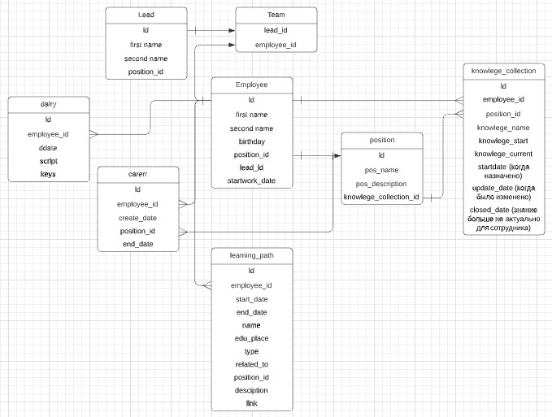

# TeamForge

Project is aimed for developing and growing teams (based on talent management)

### Data Structure

### TODO

- [x] Разработать структуру БД (v1)

- [ ] Сделать базовый html шаблон (для основных страниц)

- [ ] Сделать форму заполнения данных о сотруднике

- [ ] Сделать расчет компитенций и уровни (джун, мидл, синьор):

- [ ] Разработать структуру БД (v2)
   
- [ ] Функции расчета значков:

- [ ] Alpha release

- [ ] функции записи учебных планов / проекция на компитенции:

- [ ] Beta release

- [ ] Сделать форму визуализации ( как в эксель):

- [ ] Main release